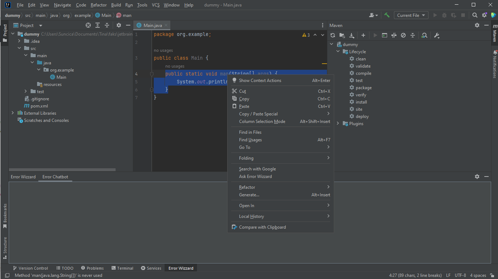
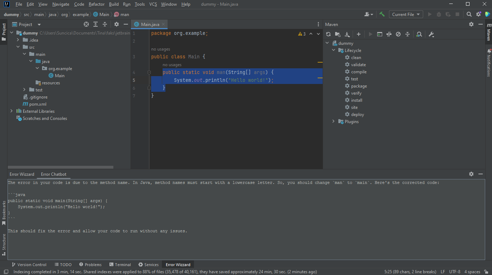

# Error Wizard Plugin

## Overview

The **Error Wizard** plugin for IntelliJ IDEA enhances your development experience by allowing you to select parts of your code causing error messages and interact with a chatbot powered by Groq's LLaMA language model. This plugin aims to provide immediate context and assistance for error messages, streamlining debugging and development.

## Features

- **Select Error Messages**: Easily select error messages from the code.
- **Chatbot Interaction**: Send selected error messages to the chatbot for explanations, solutions, and suggestions.
- **Custom Tool Window**: View chatbot responses in a dedicated tool window within IntelliJ IDEA.

## Installation

1. Clone the repository
2. Open the project in IntelliJ IDEA
3. Insert Groq API key (free to make @ https://groq.com/) at `src/main/java/actions/ChatbotClient.java`
3. Run plugin
3. Select part of code that's showing the error & `right-click`
4. Choose `Ask Error Wizzard` from the tool menu
5. Check the output of the LLaMA model inside the custom `Error Wizzard tool window`

## Mini Demo

## Limitations & Improvements
- Currently, it is possible to select code parts only. Future work would enable selecting error messages from Console and Problem windows as well.
- LLM interaction is per-search, no context saving or back and froth chatting available. Left for further development.
